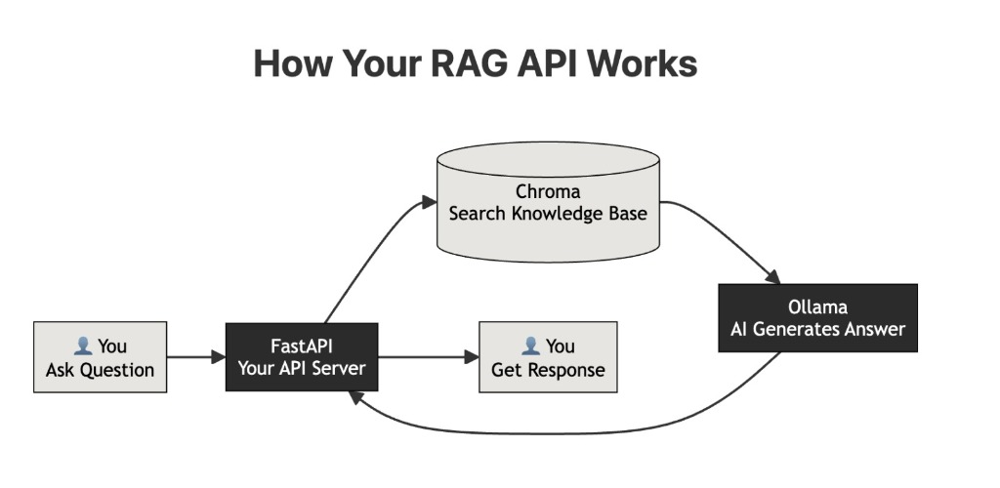

# RAG API with FastAPI

A high-performance Retrieval-Augmented Generation (RAG) API built with FastAPI, ChromaDB, and Ollama. This project demonstrates how to build a local AI agent that can be queried for specific information and dynamically updated with new knowledge.

## 🏗️ Architecture

The system follows a standard RAG pipeline architecture:



### Data Flow
1.  **User Query**: The client sends a question to the FastAPI server (`/query` endpoint).
2.  **Vector Search**: The server queries **ChromaDB** using the input question to find the most relevant context from the stored embeddings.
3.  **Context Retrieval**: ChromaDB returns the most similar document segments.
4.  **Augmented Generation**: The server constructs a prompt containing both the user's question and the retrieved context.
5.  **LLM Inference**: The prompt is sent to the local **Ollama** instance (running `tinyllama`).
6.  **Response**: The LLM generates an accurate answer based on the context, which is returned to the user.

---

## 🚀 Features

-   **FastAPI Backend**: Robust and fast web server.
-   **Local LLM Support**: Uses Ollama for privacy-focused, local inference.
-   **Vector Database**: Integrated ChromaDB for efficient semantic search.
-   **Dynamic Knowledge updates**: API endpoint to add new documents to the knowledge base on the fly.
-   **Swagger UI**: Built-in interactive API documentation.

---

## 🛠️ Prerequisites

Before running the project, ensure you have the following installed:

-   **Python 3.9+**
-   **[Ollama](https://ollama.com/)** (with `tinyllama` model pulled)

```bash
# Pull the required model
ollama pull tinyllama
```

---

## 📦 Installation

1.  **Clone the repository**
    ```bash
    git clone <repository-url>
    cd RAG-API-with-FastAPI
    ```

2.  **Create a Virtual Environment**
    ```bash
    python -m venv venv
    
    # Windows
    venv\Scripts\activate
    
    # Mac/Linux
    source venv/bin/activate
    ```

3.  **Install Dependencies**
    ```bash
    pip install fastapi uvicorn chromadb ollama
    ```

4.  **Initialize Knowledge Base** (Optional)
    The project includes an `embed.py` script to seed the database with initial data (e.g., specific documentation).
    ```bash
    python embed.py
    ```

---

## ⚡ Usage

### 1. Start the Server
Run the FastAPI application using Uvicorn:

```bash
uvicorn app:app --reload
```
The API will be available at `http://localhost:8000`.

### 2. Query the Agent
Send a POST request to ask a question.

**cURL Example:**
```bash
curl -X 'POST' \
  'http://localhost:8000/query?q=What%20is%20Kubernetes%3F' \
  -H 'accept: application/json'
```

**Response:**
```json
{
  "answer": "Kubernetes is an open-source container orchestration platform..."
}
```

### 3. Add New Knowledge
Dynamically add new text to the knowledge base without restarting the server.

**cURL Example:**
```bash
curl -X 'POST' \
  'http://localhost:8000/add?text=FastAPI%20is%20a%20modern%20web%20framework%20for%20building%20APIs.' \
  -H 'accept: application/json'
```

---

## 📖 API Documentation

Once the server is running, you can access the interactive Swagger UI documentation:

-   **Swagger UI**: [http://localhost:8000/docs](http://localhost:8000/docs)
-   **ReDoc**: [http://localhost:8000/redoc](http://localhost:8000/redoc)

---

## 👤 Context & Motivation

*Originally created by Sanjay Ganesh to explore the implementation of RAG Pipelines.*

**Why I did this project:**
I wanted to understand how AI can be used in real applications beyond simple chatbots. By connecting APIs, databases, and AI models, I learned how to build a practical RAG system from scratch.

**Key Learnings:**
-   **RAG (Retrieval-Augmented Generation)**: Combining retrieval with generation for accurate answers.
-   **Embeddings**: Understanding how to represent text numerically for search.
-   **Local AI**: Running models like TinyLlama locally with Ollama.
